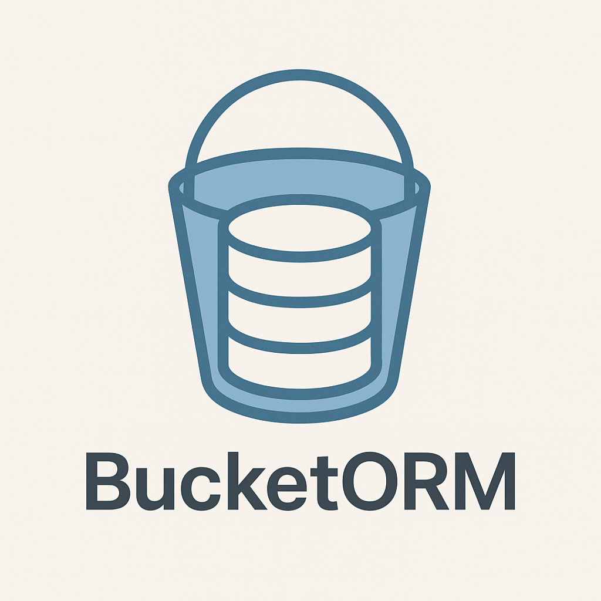

# BucketORM



> A TypeScript-first ORM for Amazon S3 and S3-compatible storage solutions

[](https://badge.fury.io/js/bucketorm)
[](https://www.typescriptlang.org/)
[](https://opensource.org/licenses/MIT)

Transform Amazon S3 and S3-compatible storage into a powerful, cost-effective database alternative for applications requiring simple JSON document storage.

**Why BucketORM?**  
Stop paying $50/month for databases to store simple JSON records. Use S3 instead for ~$0.02/GB with zero compute costs.

## Table of Contents

- [Installation](#installation)
- [Quick Start](#quick-start)
- [Features](#features)
- [API Reference](#api-reference)
- [Configuration](#configuration)
- [Local Development](#local-development)
- [Examples](#examples)
- [Data Storage](#data-storage)
- [Testing](#testing)
- [Contributing](#contributing)
- [License](#license)

## Installation

```bash
npm install bucketorm
```

## Quick Start

```typescript
import { BucketORM, BucketRecord } from 'bucketorm';

// Define your data model
type User = BucketRecord<{
  name: string;
  email: string;
  age: number;
  role: 'admin' | 'user' | 'guest';
  active: boolean;
}>;

// Initialize BucketORM
const orm = new BucketORM({
  bucket: 'my-app-data',
  region: 'us-east-1',
  accessKeyId: process.env.AWS_ACCESS_KEY_ID!,
  secretAccessKey: process.env.AWS_SECRET_ACCESS_KEY!,
});

// Create a model
const userModel = orm.model<User>('user');

// CRUD operations
const user = await userModel.create({
  data: {
    id: 'user-123',
    name: 'John Doe',
    email: 'john@example.com',
    age: 30,
    role: 'admin',
    active: true,
  }
});

const foundUser = await userModel.findOne('user-123');
const allUsers = await userModel.findMany();
const activeUsers = await userModel.findMany({ where: { active: true } });

await userModel.update('user-123', { data: { age: 31 } });
await userModel.delete('user-123');
```

## Features

- **TypeScript-First**: Complete type safety with multiple model definition approaches
- **Familiar ORM Interface**: Standard CRUD operations with intuitive syntax
- **Schema Validation**: Built-in Zod integration for data integrity
- **Multi-Provider Support**: AWS S3, MinIO, Cloudflare R2, DigitalOcean Spaces
- **Zero Runtime Dependencies**: Lightweight with minimal external requirements
- **Local Development**: MinIO integration for offline development
- **Cost Effective**: Leverage S3's pricing model for significant cost savings

## API Reference

### BucketORM

The main class for interacting with your S3-compatible storage.

#### Constructor

```typescript
new BucketORM(config: BucketORMConfig)
```

**Parameters:**
- `config.bucket` - S3 bucket name
- `config.region` - AWS region
- `config.accessKeyId` - AWS access key ID
- `config.secretAccessKey` - AWS secret access key
- `config.endpoint` - (Optional) Custom S3 endpoint for S3-compatible services
- `config.forcePathStyle` - (Optional) Force path-style URLs

#### Methods

##### `model<T>(name: string)`

Create a model instance for CRUD operations.

```typescript
const userModel = orm.model<User>('user');
```

##### `schemaModel<T>(name: string, schema: SchemaDefinition)`

Create a model with schema validation.

```typescript
const userModel = orm.schemaModel<User>('user', userSchema);
```

### Model Methods

#### `create(input: CreateInput<T>)`

Create a new record.

```typescript
const user = await userModel.create({
  data: {
    id: 'user-123',
    name: 'John Doe',
    email: 'john@example.com'
  }
});
```

#### `findOne(id: string)`

Find a single record by ID.

```typescript
const user = await userModel.findOne('user-123');
```

#### `findMany(options?: FindManyOptions<T>)`

Find multiple records with optional filtering.

```typescript
const users = await userModel.findMany();
const activeUsers = await userModel.findMany({ where: { active: true } });
```

#### `update(id: string, input: UpdateInput<T>)`

Update an existing record.

```typescript
await userModel.update('user-123', { data: { age: 31 } });
```

#### `delete(id: string)`

Delete a record.

```typescript
await userModel.delete('user-123');
```

### TypeScript Types

#### Model Definition Approaches

**1. Manual Interface**

```typescript
interface User {
  id: string;
  name: string;
  email: string;
  age: number;
  createdAt: Date;
  updatedAt: Date;
}
```

**2. BucketRecord Utility**

```typescript
type User = BucketRecord<{
  name: string;
  email: string;
  age: number;
}>;
```

**3. Schema-First with Validation**

```typescript
import { z, InferModel, createSchemaDefinition } from 'bucketorm';

const userSchema = z.object({
  id: z.string(),
  name: z.string().min(2),
  email: z.string().email(),
  age: z.number().min(13),
  role: z.enum(['admin', 'user', 'guest']),
});

type User = InferModel<typeof userSchema>;
```

📖 **[Complete TypeScript Guide](./TYPESCRIPT.md)** - Advanced patterns and best practices

## Configuration

### Environment Variables

```bash
# AWS S3 (Production)
AWS_ACCESS_KEY_ID=your-access-key
AWS_SECRET_ACCESS_KEY=your-secret-key
AWS_REGION=us-east-1
BUCKET_NAME=your-bucket-name

# MinIO (Local Development)
S3_ENDPOINT=http://localhost:9000
S3_FORCE_PATH_STYLE=true
```

### Provider Examples

#### AWS S3

```typescript
const orm = new BucketORM({
  bucket: 'production-bucket',
  region: 'us-east-1',
  accessKeyId: process.env.AWS_ACCESS_KEY_ID!,
  secretAccessKey: process.env.AWS_SECRET_ACCESS_KEY!,
});
```

#### MinIO (Local Development)

```typescript
const orm = new BucketORM({
  bucket: 'dev-bucket',
  endpoint: 'http://localhost:9000',
  accessKeyId: 'minio',
  secretAccessKey: 'minio123',
  region: 'us-east-1',
  forcePathStyle: true,
});
```

#### Cloudflare R2

```typescript
const orm = new BucketORM({
  bucket: 'my-r2-bucket',
  endpoint: 'https://your-account.r2.cloudflarestorage.com',
  accessKeyId: process.env.R2_ACCESS_KEY_ID!,
  secretAccessKey: process.env.R2_SECRET_ACCESS_KEY!,
  region: 'auto',
});
```

## Local Development

### Prerequisites

- Node.js 16+
- Docker and Docker Compose

### Setup

1. Clone the repository:
   ```bash
   git clone <repository-url>
   cd bucketorm
   npm install
   ```

2. Set up environment:
   ```bash
   cp .env.example .env
   ```

3. Start MinIO:
   ```bash
   docker-compose up -d
   ```

4. Access MinIO Console at http://localhost:9090 (minio/minio123)

### Development Scripts

```bash
# Build
npm run build

# Test
npm test
npm run test:watch

# Lint and format
npm run lint
npm run format

# Examples
npm run dev              # Basic CRUD operations
npm run dev:schema       # Schema validation
npm run dev:typescript   # TypeScript patterns
```

## Examples

### Basic Usage

```typescript
import { BucketORM, BucketRecord } from 'bucketorm';

type Product = BucketRecord<{
  name: string;
  price: number;
  category: string;
}>;

const orm = new BucketORM({ /* config */ });
const products = orm.model<Product>('product');

// Create
const product = await products.create({
  data: {
    id: 'prod-1',
    name: 'Laptop',
    price: 999.99,
    category: 'Electronics'
  }
});

// Query
const expensive = await products.findMany({
  where: { price: { gt: 500 } }
});
```

### With Schema Validation

```typescript
import { z, InferModel, createSchemaDefinition } from 'bucketorm';

const productSchema = z.object({
  id: z.string(),
  name: z.string().min(1),
  price: z.number().positive(),
  category: z.string(),
});

type Product = InferModel<typeof productSchema>;

const products = orm.schemaModel<Product>('product', 
  createSchemaDefinition(productSchema)
);

// Automatic validation
await products.createWithValidation({ data: productData });
```

### Use Cases

- **User Management**: Store user profiles, preferences, and settings
- **Content Management**: Blog posts, articles, and media metadata
- **Analytics**: Event logs, metrics, and reporting data
- **Configuration**: Application settings and feature flags
- **Session Storage**: User sessions and temporary data

## Data Storage

### File Structure

```
s3://your-bucket/
├── user/
│   ├── user-123.json
│   ├── user-456.json
│   └── user-789.json
├── product/
│   ├── prod-abc.json
│   └── prod-def.json
└── order/
    └── order-xyz.json
```

### JSON Format

```json
{
  "id": "user-123",
  "name": "John Doe",
  "email": "john@example.com",
  "age": 30,
  "role": "admin",
  "active": true,
  "createdAt": "2024-01-15T10:30:00.000Z",
  "updatedAt": "2024-01-15T10:30:00.000Z"
}
```

## Testing

BucketORM uses a robust testing setup with proper isolation:

- **Test Isolation**: Each test uses unique IDs to avoid conflicts
- **Separate Test Bucket**: Tests use `bucketorm-test` bucket, isolated from development data
- **Automatic Cleanup**: `beforeEach`/`afterEach` hooks ensure clean state between tests
- **MinIO Integration**: Tests run against real MinIO instance for authentic testing

```bash
# Prerequisites: Start MinIO
docker-compose up -d

# Run all tests
npm test

# Tests include:
# ✓ CRUD operations (create, read, update, delete)
# ✓ Schema validation with Zod
# ✓ Error handling and edge cases
# ✓ TypeScript type safety
```

The test setup automatically creates both development (`bucketorm-dev`) and test (`bucketorm-test`) buckets in MinIO.

## Contributing

We welcome contributions! Please see our [Contributing Guide](./CONTRIBUTING.md) for details on:

- Code of conduct
- Development process
- Submitting pull requests
- Running tests
- Reporting bugs

## License

[MIT](LICENSE) © BucketORM

---

## Acknowledgments

- Inspired by [Prisma](https://prisma.io) for developer experience
- Built with [Zod](https://zod.dev) for schema validation
- Powered by [AWS SDK](https://aws.amazon.com/sdk-for-javascript/) for S3 operations
